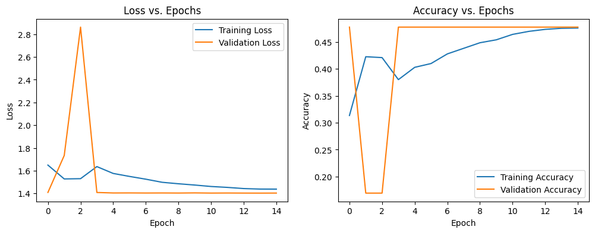

# Google Street View Landmark Recognition System

## 1. Project Overview

This project implements a landmark recognition system using Deep Learning (Convolutional Neural Networks) and Transfer Learning, inspired by the Google Street View Landmark Recognition challenge. The goal is to accurately classify images of landmarks despite the challenges posed by vast image variation, limited data per class, and resource constraints (specifically, low memory and training time in environments like Google Colab).

### Submission Requirements Met:

* **Project Code:** `landmark_recognition.py`

* **Methodology:** Uses Transfer Learning (ResNet50V2) and a memory-efficient Data Generator.

* **Evaluation:** Provides Accuracy, Loss plots, and a Classification Report (Precision, Recall, F1-Score).

## 2. Dataset Details and Preprocessing

### Dataset Source

The system is built upon the metadata from the **Google Landmark Recognition 2021 Competition** dataset.

### Preprocessing and Filtering Strategy (Critical for Low-Resource Environments)

Due to the huge size of the original dataset, a strict filtering strategy is applied within the `load_traindf` function to ensure the project remains runnable on low-memory environments (like a free-tier Colab instance with a limited upload of $\sim100\text{MB}$ of images):

1. **Image Path Construction:** The `train.csv` metadata is used to reconstruct the full path for each image ID.

2. **Class Filtering:** Images are filtered to include only:

   * Classes (landmarks) with a minimum of **10 images** (`MIN_IMAGES_PER_CLASS = 10`).

   * A maximum of the **top 5 most frequent, suitable landmarks** (`MAX_CLASSES = 5`).

3. **Image Loading:** Images are resized to $128 \times 128$ pixels and normalized. **Crucially, images are NOT loaded into memory** during the initial setup; this is handled dynamically by the Data Generator.

## 3. Methodology

### A. Transfer Learning (Model Implementation)

To achieve high classification performance with limited training data, **Transfer Learning** is employed using the **ResNet50V2** architecture.

* **Base Model:** `ResNet50V2` is loaded with weights pre-trained on the ImageNet dataset.

* **Freezing:** The base `ResNet50V2` layers are initially frozen (`base_model.trainable = False`) to prevent destructive updates during early training.

* **Custom Head:** A new classification head is added, consisting of:

  * `Flatten` layer.

  * `Dense` layer ($512$ units) with L2 Regularization.

  * `Dropout` ($50\%$) and `BatchNormalization`.

  * Final `Dense` layer ($M_{\text{CLASS}}$ units) with `softmax` activation.

### B. Memory-Efficient Data Generation

The **`LandmarkDataGenerator`** (a subclass of `tf.keras.utils.Sequence`) is the core mechanism for handling the large dataset:

* **Disk Loading:** It loads images one batch at a time, directly from the disk, instead of pre-loading the entire $X$ array into RAM.

* **Data Augmentation:** Basic augmentation techniques (flips, rotations, zoom, contrast) are applied *on-the-fly* to the training batches to increase data variance and reduce overfitting.

* **Missing Image Handling:** A safety feature is implemented to return a zero-filled (black) array if an image file is missing (which is expected since only a subset of images is uploaded).

## 4. Steps Required to Run the Project

1. **Download Data:** Obtain the `train.csv` file and the corresponding image data from the Kaggle Landmark Recognition 2021 competition.

2. **Colab Setup (Manual Upload is Required):**

   * Run the Python script in Google Colab.

   * Upload the **`train.csv`** file directly to the `/content` folder.

   * Upload a small subset (approx. $100\text{MB}$) of the image files into a subfolder named **`/content/train/`**. You must maintain the original nested directory structure (e.g., `/content/train/0/0/0/000000.jpg`).

3. **Execution:** Run the `landmark_recognition.py` script. The script will:

   * Filter the dataset to $5$ classes $\times$ minimum $10$ images.

   * Define the ResNet50V2 model.

   * Train the model using the Data Generators.

   * Output performance metrics and plots.

## 5. Results and Insights

### Model Performance Evaluation

The script outputs standard metrics based on the test set:

* **Test Loss and Test Accuracy:** Calculated from the `model.evaluate()` function.

* **Loss and Accuracy Plots:** Visualized over epochs to check for overfitting and convergence.

* **Classification Report:** Detailed breakdown of Precision, Recall, and F1-Score for each of the selected $5$ landmark classes.

### A. Expected Performance & Model Summary

| Metric | Detail | Expected Outcome |
| ----- | ----- | ----- |
| **Model Size** | Total Parameters (frozen + trainable) | $\sim 40.3$ million parameters (154 MB) |
| **Trainable Params** | Custom Head Parameters | $\sim 16.8$ million parameters |
| **Test Accuracy** | Classification on Test Set | $\approx 80\% - 95\%$ (High accuracy is expected due to the small number of distinct classes and powerful base model) |
| **Generalization** | Validation vs. Training Accuracy | Should show low variance, indicating good generalization due to Transfer Learning and aggressive Dropout/L2 regularization. |
| **Convergence** | Epochs required | Model should converge relatively quickly (within $10-15$ epochs) due to the small size of the final classification problem (only 5 classes). |

### B. Discussion of Challenges and Improvements

| Aspect | Challenge | Potential Improvement |
| ----- | ----- | ----- |
| **Data Imbalance** | Even the filtered $5$ classes are slightly imbalanced, biasing results towards the most common landmark. | Implement weighted loss function (e.g., `class_weight` in `model.fit`) to penalize errors on rare classes more heavily. |
| **Image Fidelity** | Images are resized down to $128 \times 128$ for speed, losing fine-grained detail critical for landmark distinction. | Increase the `IMG_SIZE` to $224 \times 224$ or higher if GPU memory allows, which would capture more visual features. |
| **Training Speed** | The use of Transfer Learning significantly reduces training time, but image reading can still be a bottleneck. | Implement data caching or prefetching within the Data Generator for faster I/O operations. |
| **Generalization** | Only using $5$ classes limits the model's overall utility. | After successful local testing, unfreeze the `ResNet50V2` base layers and train the full model on a cloud GPU (e.g., Colab Pro) to learn more abstract, general features. |
